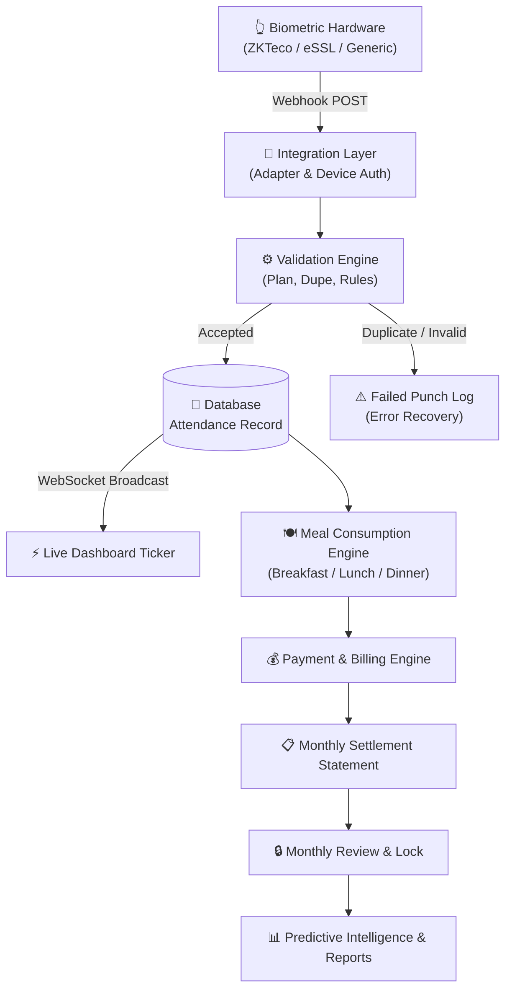

# 📊 ATTENDIQ — Enterprise Presentation

**Biometric Attendance, Service Consumption & Monthly Settlement System**

---

## Executive Summary

**ATTENDIQ** (BioSync) is an enterprise-grade, end-to-end biometric attendance, service consumption, and monthly settlement software. Unlike traditional fragmented attendance products, ATTENDIQ operates as **one controlled workflow** — directly bridging physical biometric scanners to real-time telemetry, automated validation, service tracking (meals/dormitory), billing, monthly closing, and predictive intelligence.

---

## 📑 Slide Deck Index

1. **Problem Statement & Market Gap**
2. **System Vision & Core Concept**
3. **End-to-End Connected Pipeline Architecture**
4. **The 21 Core Functional Modules**
5. **Role-Based Access Control (RBAC) & Security**
6. **Biometric Integration & Real-time WebSockets**
7. **6-Stage Attendance Validation Engine**
8. **Meals & Service Consumption Tracking**
9. **Financial Billing & Monthly Settlement Engine**
10. **Monthly Closing, Approval & Immutable Locking**
11. **Intelligence, Anomaly Detection & Forecasting**
12. **Technical Stack & Deployment Architecture**

---

## Slide 1: Problem Statement & Market Gap

> [!WARNING]
> **Traditional Attendance Systems Fail at Workflow Integration**

* **Module Isolation**: Biometric logs exist in machine software, attendance is kept in Excel, and billing is calculated manually in accounting tools.
* **Ghost Attendance & Duplicate Punches**: Single users scanning multiple times within minutes create inflated attendance counts.
* **Service Disconnect**: Educational institutions, hostels, and corporate mess facilities cannot link entry attendance with meal/facility consumption.
* **Financial Leakage & Tampering**: Past attendance and billing records are altered post-settlement due to lack of strict month-locking and audit trails.

---

## Slide 2: System Vision — The Single Controlled Pipeline

ATTENDIQ unifies physical biometrics, validation rules, operations, finance, and monthly settlement into **one continuous business process**:

```
Biometric Machine
      ↓
  HTTP Webhook / Push API
      ↓
Validation Engine (Plan / Rules / Duplicates)
      ↓
Real-Time Dashboard (WebSocket)
      ↓
Operations (Meal & Service Tracking)
      ↓
Finance (Payments & Billing)
      ↓
Monthly Settlement & Lock
      ↓
Intelligence & Anomaly Detection
```

---

## Slide 3: End-to-End Connected Pipeline Architecture



---

## Slide 4: The 21 Core Functional Modules

| Category | Modules | Core Capability |
|---|---|---|
| **Security & Auth** | `#1 Login & RBAC`<br/>`#19 Audit Logs`<br/>`#20 Security Guards` | JWT auth, dual RBAC roles, immutable audit trail of who changed what, when, and why. |
| **People & Plans** | `#2 Client Management`<br/>`#10 Membership Plans` | Client profiles with Biometric ID mapping; customizable monthly plans with meal limits. |
| **Biometric Telemetry**| `#3 Device Integration`<br/>`#4 Automatic Sync`<br/>`#5 Real-time Dashboard`<br/>`#17 Device Monitoring`<br/>`#18 Error Recovery` | Multi-vendor hardware adapters, live WebSocket telemetry, device uptime heartbeats, failed retry queue. |
| **Attendance Processing**| `#6 Attendance Logging`<br/>`#7 Validation Engine`<br/>`#8 Duplicate Protection`<br/>`#9 Attendance Rules` | 6-stage punch validation, 5-minute duplicate window suppression, late thresholds, holiday calendars. |
| **Operations & Meals**| `#12 Meal Consumption`<br/>`#15 Search & Filters` | Independent tracking of Breakfast, Lunch, and Dinner scans against plan quota. |
| **Finance & Closing** | `#11 Payment Management`<br/>`#13 Daily/Monthly Totals`<br/>`#14 Monthly Settlement`<br/>`#21 Monthly Lock` | UPI/Cash payment ledger, automated monthly invoice calculation, and read-only month locking. |
| **Intelligence** | `#16 System Alerts`<br/>`#21 PDF/Excel Reports`<br/>`Intelligence Module` | Anomaly detection, plan expiry alerts, 7-day rolling forecast, exportable statements. |

---

## Slide 5: Role-Based Access Control (RBAC) & Security

ATTENDIQ features strict role separation enforced at both the **Backend API (JWT)** and **Frontend UI**:

### 🔐 Super Admin
* **Scope**: Full Administrative & Financial Control.
* **Capabilities**: Client CRUD, Plan Creation, Device Configuration, Attendance Rule Modification, Financial Settlement, Monthly Locking/Unlocking, Audit Log inspection, User Management.
* **Seeded Credentials**: `admin@system.com` / `admin123`

### ◈ Staff Operator
* **Scope**: Daily Operational Access.
* **Capabilities**: Search Clients, View Attendance, Record Payments, Daily Attendance Ticker, Manual Attendance Entry.
* **Restrictions**: ❌ Cannot create/edit/delete clients, ❌ Cannot change biometric rules, ❌ Cannot edit plans or financial statements, ❌ Cannot modify locked months.
* **Self-Registration**: Self-created accounts (`/register`) are automatically provisioned as **Staff Operators**.

---

## Slide 6: Biometric Integration & Real-Time Telemetry

> [!NOTE]
> **Universal Device Adapter Layer**

ATTENDIQ isolates machine-specific protocols into a pluggable integration layer:

* **Generic HTTP Webhooks**: Ingests JSON payloads from any smart IP scanner.
* **ZKTeco / eSSL ADMS Adapter**: Auto-detects push formats (`SN`, `PIN`, `DateTime`).
* **WebSocket Ticker**: Real-time push notification over `ws://127.0.0.1:8000/ws/attendance` instantly updating the React dashboard without page reloads.

---

## Slide 7: 6-Stage Attendance Validation Engine

When a biometric scan arrives at `/api/v1/attendance/webhook`:

```
1. DEVICE AUTHENTICATION    → Is device registered & active?
        ↓ YES
2. CLIENT IDENTIFICATION     → Map biometric_user_id to active Client record
        ↓ YES
3. CLIENT STATUS CHECK       → Is client status == 'active'?
        ↓ YES
4. PLAN VALIDITY CHECK       → Is client's assigned plan active today?
        ↓ YES
5. DUPLICATE SCAN CHECK      → Was a punch recorded within last 5 minutes?
        ↓ NO
6. TIME & RULE VALIDATION    → Is scan within allowed hours? Flag PRESENT / LATE
        ↓ YES
ATTENDANCE ACCEPTED & RECORDED
```

---

## Slide 8: Meals & Service Consumption Tracking

ATTENDIQ treats **General Entry Attendance** and **Service/Meal Consumption** as distinct operational events:

* **Punch Types**: `IN`, `OUT`, `BREAKFAST`, `LUNCH`, `DINNER`.
* **Meal Quota Tracking**: Each client plan defines a monthly meal limit (e.g., 90 meals/month).
* **Per-Client Breakdown**: Daily meal consumption is tracked per station and rolled into the monthly statement.

---

## Slide 9: Financial Billing & Monthly Settlement Engine

At the end of each billing cycle, ATTENDIQ automatically generates a **Monthly Statement** for every client:

$$\text{Balance Due} = \text{Plan Monthly Fee} + \text{Extra Service Charges} - \text{Total Payments Received}$$

### Example Statement Structure:
```
Rahul Patil (STU-2026-001) — August 2026
─────────────────────────────────────────
Plan Fee (Monthly Meal Plan)   : ₹3,500
Attendance Recorded            : 24 Days Present / 7 Days Absent
Meals Consumed                 : Breakfast: 20 | Lunch: 23 | Dinner: 24
Total Payments Received        : ₹3,500 (UPI Ref #987213)
-----------------------------------------
NET BALANCE DUE                : ₹0 (PAID)
```

---

## Slide 10: Monthly Review, Approval & Lock

To prevent retroactive editing of financial and attendance data:

1. **Admin Review**: Admin verifies monthly attendance totals, meal counts, and payments.
2. **Approval**: Admin clicks `APPROVE & LOCK MONTH`.
3. **Immutability**: Once locked, all records for that month become **READ-ONLY**.
4. **Super Admin Override**: Only a Super Admin can explicitly unlock a month, generating an entry in the Audit Log.

---

## Slide 11: Intelligence, Anomaly Detection & Forecasting

* **Attendance Ranking**: Ranks clients by monthly attendance percentage.
* **Anomaly Detection**: Identifies suspicious duplicate punch spikes or unmapped biometric IDs.
* **Predictive Forecasting**: Uses a 7-day rolling average to forecast weekly/monthly attendance volume and expected revenue.

---

## Slide 12: Technical Architecture & Stack

```
Frontend:  React 18 + TypeScript + Vite + Glassmorphism Dark CSS (Port 3000)
Backend:   FastAPI 0.104 + Python 3.10+ + Uvicorn Async Server (Port 8000)
Database:  SQLAlchemy 2.0 ORM + SQLite (Development) / PostgreSQL (Production)
Realtime:  Native WebSockets
Repo:      github.com/Revu-15/Biometric-Attendance-Management-System
```

---

## 🎯 Conclusion & Demonstration Links

* **Live Dashboard**: [http://localhost:3000](http://localhost:3000)
* **Swagger API Explorer**: [http://127.0.0.1:8000/docs](http://127.0.0.1:8000/docs)
* **GitHub Repository**: [Revu-15/Biometric-Attendance-Management-System](https://github.com/Revu-15/Biometric-Attendance-Management-System)
